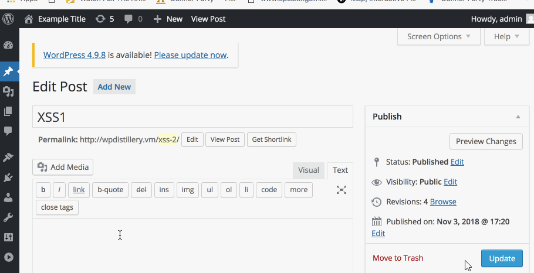

# Project 7 - WordPress Pentesting

Time spent: **5** hours spent in total

> Objective: Find, analyze, recreate, and document **five vulnerabilities** affecting an old version of WordPress

## Pentesting Report

**1. Authenticated Stored Cross Site Scripting**
  - Summary: 
    - Vulnerability types: Cross Site Scripting
    - Tested in version 4.2
    - Fixed in version: 4.2.3
  - GIF Walkthrough:
  
  - Steps to recreate: 
	- make a new post
	- write the javascript in the body of the post
	- publish the post
	- view the post new post

**2. Authenticated Stored Cross Site Scripting via Image frame**
  - Summary: 
    - Vulnerability types: Cross Site Scripting
    - Tested in version: 4.2
    - Fixed in version: 4.2.1
  - GIF Walkthrough:
  
  - Steps to recreate:
	- Add a new image in media
	- Click on the new image then edit more details
	- Add the javascript in the image name in the title section
	- Click update and open the permalink

**3. User Authentication**
  - Summary: 
    - Vulnerability types: User Authentication
    - Tested in version: 4.2
    - Fixed in version: N/A
  - GIF Walkthrough: 
  - Steps to recreate: 

## Assets

List any additional assets, such as scripts or files

## Resources

- [WordPress Source Browser](https://core.trac.wordpress.org/browser/)
- [WordPress Developer Reference](https://developer.wordpress.org/reference/)

GIFs created with [LiceCap](http://www.cockos.com/licecap/).

## Notes

Describe any challenges encountered while doing the work

## License

    Copyright [yyyy] [name of copyright owner]

    Licensed under the Apache License, Version 2.0 (the "License");
    you may not use this file except in compliance with the License.
    You may obtain a copy of the License at

        http://www.apache.org/licenses/LICENSE-2.0

    Unless required by applicable law or agreed to in writing, software
    distributed under the License is distributed on an "AS IS" BASIS,
    WITHOUT WARRANTIES OR CONDITIONS OF ANY KIND, either express or implied.
    See the License for the specific language governing permissions and
    limitations under the License.